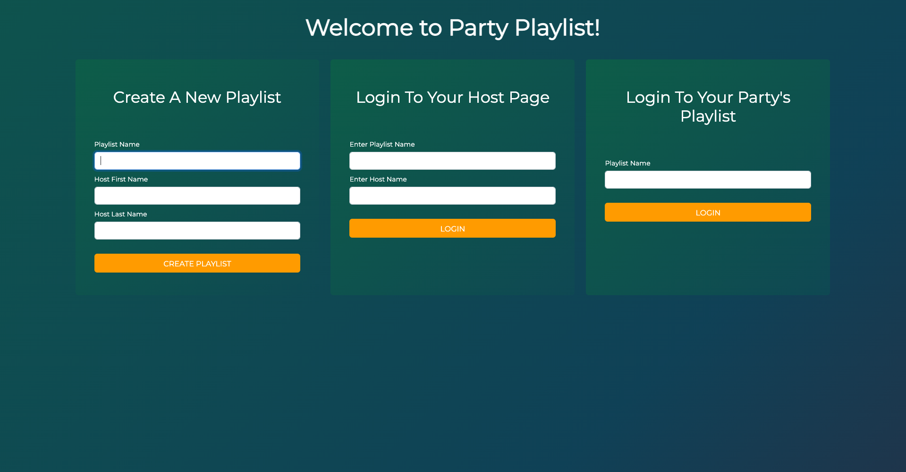
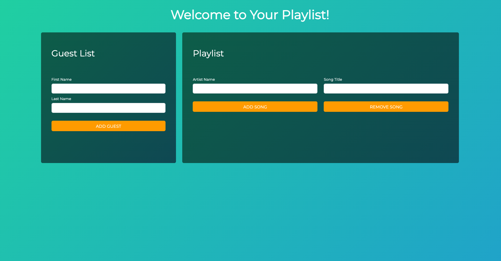
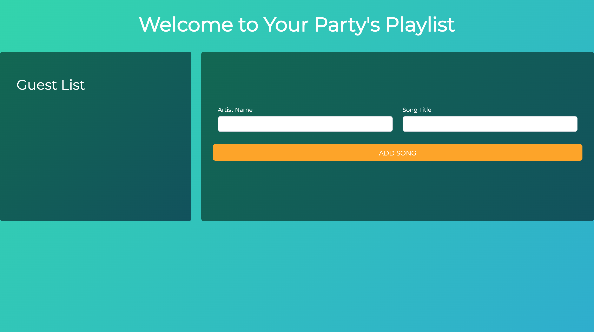

# Party Playlist

Party playlist is an application that allows a user to create playlist for a party and invite their friends to add
songs to the playlist and vote on the songs they want to hear first.

Party Playlist was a collaborative project with three other team members: Matt Leigh, Jake Price, and Matthew Reuther.

Party Playlist utilizes AWS DynamoDB, API Gateway, Lambda to store and retrieve song, playlist, and user data.


The home page allows user to create a playlist for the party, 
or sign into their party's playlist as a guest or a host.


The host page allows the host to add guests and view the guest list as well as add and remove
songs from the playlist.


The guest page allows a guest to view the guest list and playlist, add songs to the playlist, and upvote the songs they want to hear first.

## How To Run Party Playlist Locally

### Prerequisites

1. Create or use an existing Amazon AWS account and run:
`aws sso login --profile YOUR_PROFILE`

2. Install NodeJS before you can run some of the commands below (the `npm` ones).

- On Windows / WSL:
```shell
curl -fsSL https://deb.nodesource.com/setup_18.x | sudo -E bash - &&\
sudo apt-get install -y nodejs
```
- On macOS:
```shell
brew install node
```
3. Run the Lambda service (aka the backend):
    - Build the Java code: `sam build`
    - Create an S3 bucket: `aws s3 mb s3://YOUR_BUCKET` 
    - Deploy the SAM template: `sam deploy --s3-bucket BUCKET_FROM_ABOVE --parameter-overrides S3Bucket=BUCKET_FROM_ABOVE FrontendDeployment=local`
      > **NOTE:** _Yes you have to provide the same S3 bucket name twice. Yes this is annoying._
    - Create some sample data: `aws dynamodb batch-write-item --request-items file://data/data.json`
      > **TIP:** You only need to do this once.
    - Run the local API: `sam local start-api --warm-containers LAZY`
4. Run a local web server (aka the frontend):
    - CD into the web directory: `cd web`
    - Install dependencies : `npm install`
    - Run the local server: `npm run run-local`

After doing all of this, you will have a server running on port `8000` - you can access it by going to [http://localhost:8000](http://localhost:8000) in your browser.

To stop either the local backend (the `sam local...` command) or local frontend (the `npm run...`) command, simply press `Ctrl-C` in the terminal where the process is running.
